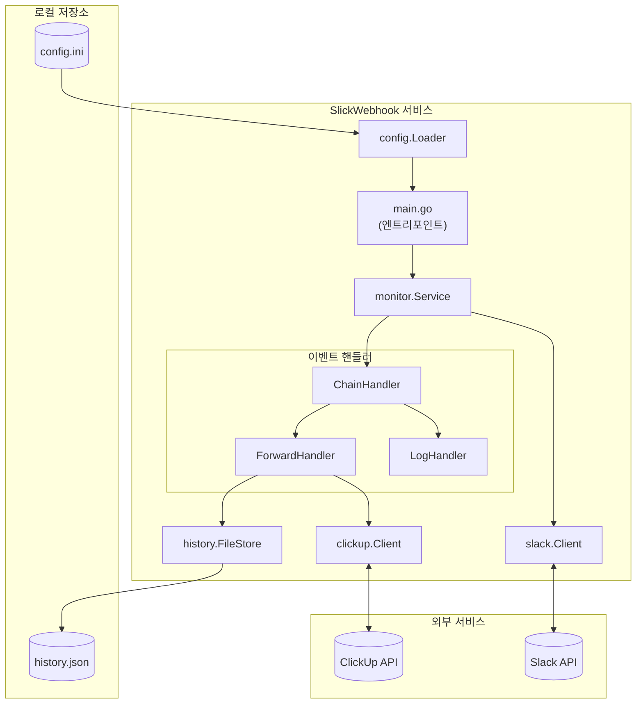
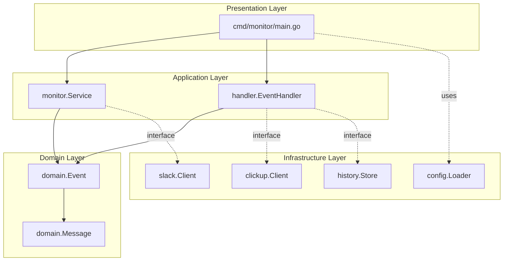
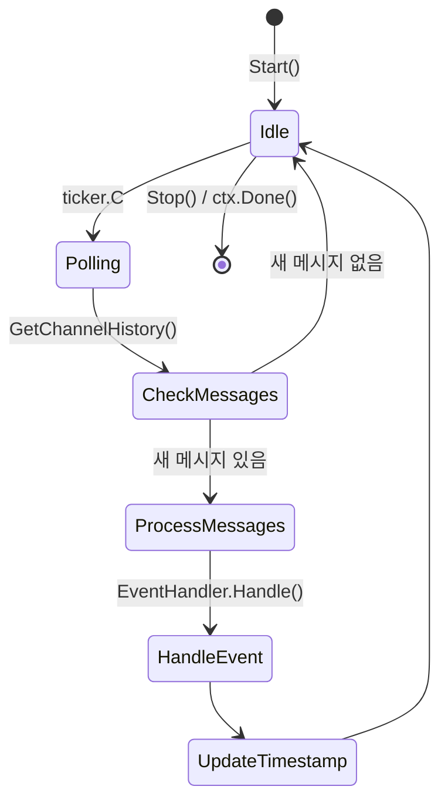
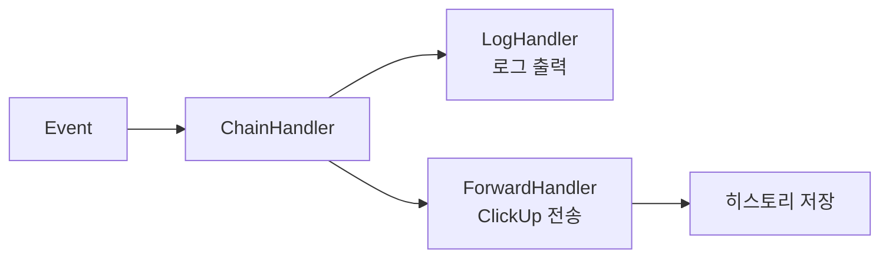
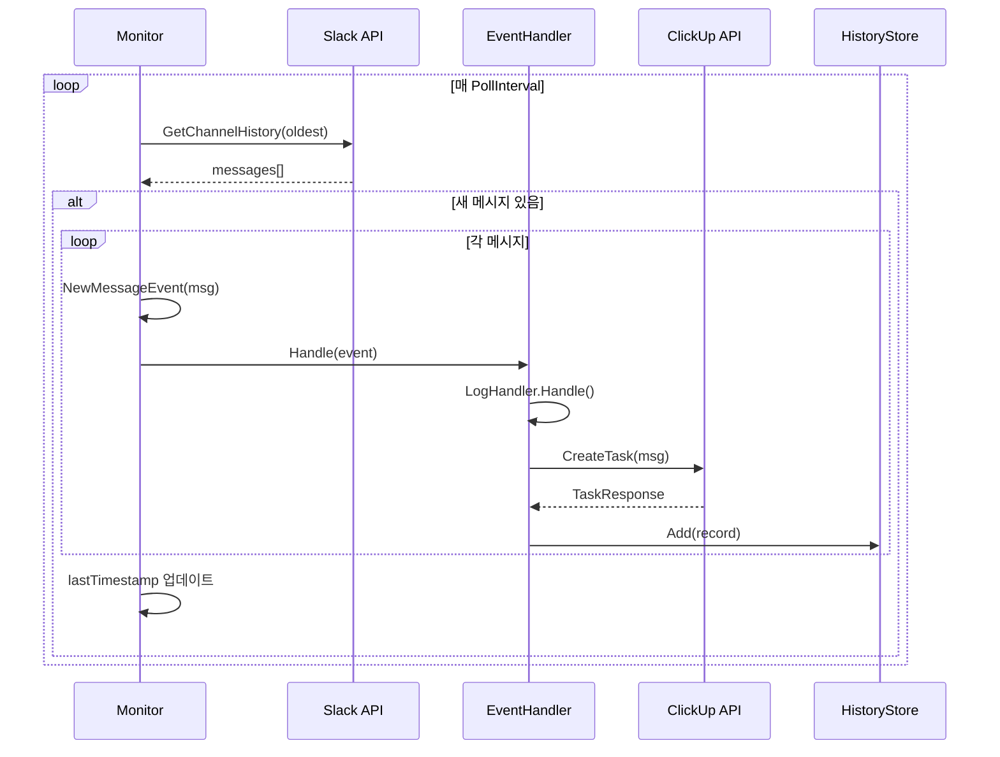
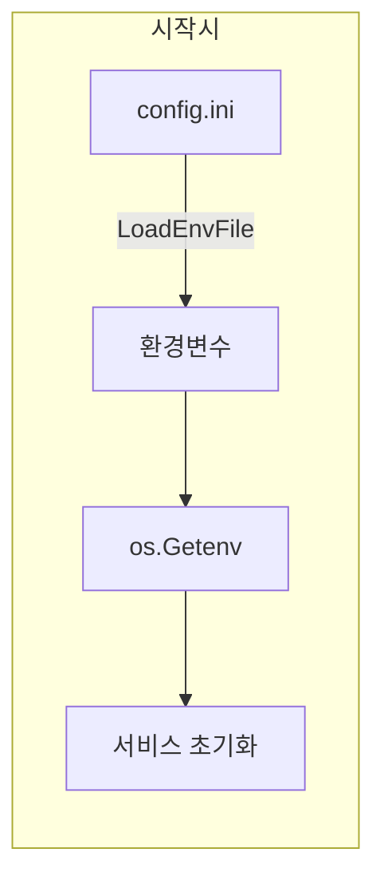
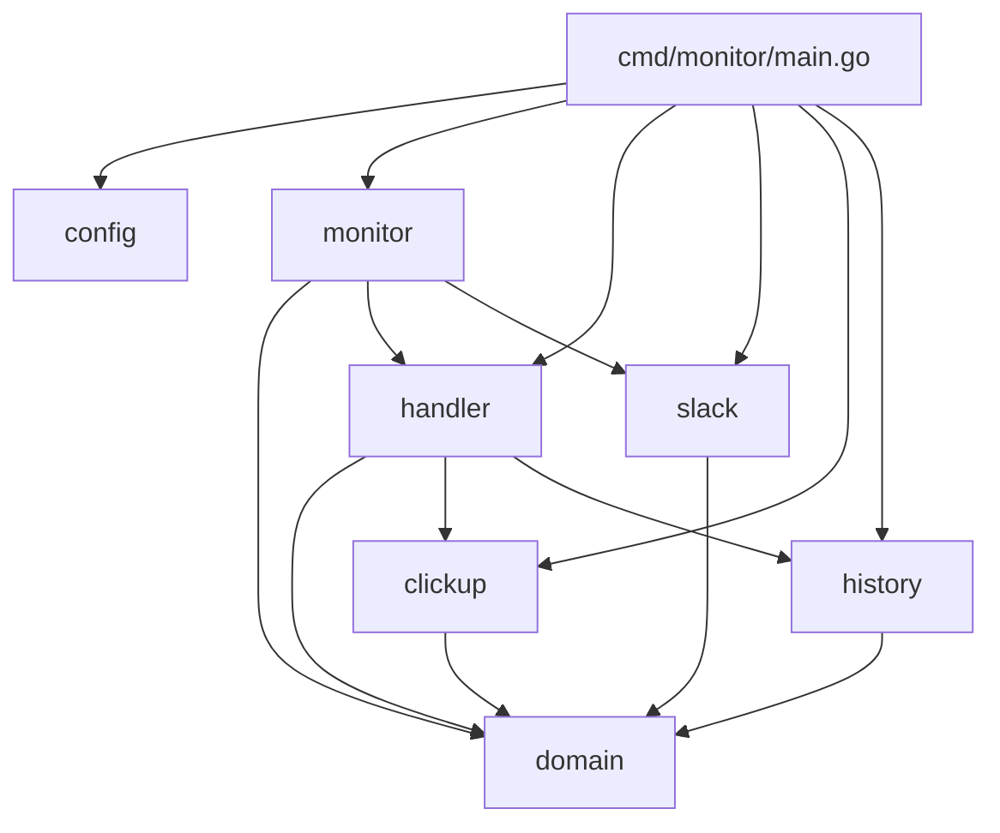

# SlickWebhook 아키텍처 문서

## 개요

SlickWebhook은 Slack 채널을 실시간으로 모니터링하고, 새 메시지 감지 시 ClickUp 태스크를 자동 생성하는 Go 기반 서비스입니다.

## 시스템 아키텍처

### 전체 구조



### 레이어 구조 (Clean Architecture)



## 컴포넌트 상세

### 1. 도메인 모델 (`internal/domain/`)

핵심 비즈니스 엔티티를 정의합니다.

| 타입 | 설명 |
|------|------|
| `Message` | Slack 메시지 (Timestamp, UserID, BotID, Text, ChannelID, CreatedAt) |
| `Event` | 이벤트 래퍼 (Type, Message, Error, OccurredAt) |
| `EventType` | 이벤트 종류 (`new_message`, `error`) |

### 2. 모니터 서비스 (`internal/monitor/`)



**주요 책임:**

- 폴링 기반 Slack 채널 모니터링
- 마지막 타임스탬프 관리 (중복 방지)
- 이벤트 생성 및 핸들러 위임

### 3. 이벤트 핸들러 (`internal/handler/`)

**Chain of Responsibility 패턴** 적용:



| 핸들러 | 역할 |
|--------|------|
| `LogHandler` | 이벤트 로그 출력 |
| `ForwardHandler` | ClickUp 태스크 생성 + 히스토리 관리 |
| `ChainHandler` | 핸들러 체이닝 (순차 실행) |

### 4. 외부 클라이언트

#### Slack Client (`internal/slack/`)

```go
type Client interface {
    GetChannelHistory(ctx context.Context, channelID, oldest string) ([]*domain.Message, error)
}
```

#### ClickUp Client (`internal/clickup/`)

```go
type Client interface {
    CreateTask(ctx context.Context, msg *domain.Message) (*TaskResponse, error)
}
```

### 5. 히스토리 저장소 (`internal/history/`)

```go
type Store interface {
    Add(record *Record)
    Count() int
}
```

- **구현체**: `FileStore` (JSON 파일 기반)
- **제한**: `HISTORY_MAX_SIZE` (기본 100개, FIFO)

## 데이터 흐름

### 메시지 처리 시퀀스



## 설정 흐름



**설정 우선순위**: `config.ini` → 환경변수

## 의존성 그래프



## 확장 포인트

### 새 이벤트 핸들러 추가

```go
// 1. EventHandler 인터페이스 구현
type MyHandler struct{}

func (h *MyHandler) Handle(event *domain.Event) {
    // 처리 로직
}

// 2. ChainHandler에 추가
eventHandler = handler.NewChainHandler(
    logHandler,
    forwardHandler,
    myHandler,  // 새 핸들러
)
```

### 새 저장소 백엔드 추가

```go
// 1. Store 인터페이스 구현
type RedisStore struct{}

func (s *RedisStore) Add(record *Record) { ... }
func (s *RedisStore) Count() int { ... }

// 2. ForwardHandler에 주입
forwardHandler := handler.NewForwardHandler(handler.ForwardHandlerConfig{
    HistoryStore: redisStore,
    ...
})
```

## 기술 스택

| 영역 | 기술 |
|------|------|
| 언어 | Go 1.25+ |
| Slack SDK | [slack-go/slack](https://github.com/slack-go/slack) |
| HTTP | 표준 라이브러리 `net/http` |
| 저장소 | 로컬 JSON 파일 |
| 배포 | 바이너리 / macOS launchd |

## 비기능 요구사항

| 항목 | 사양 |
|------|------|
| 메모리 | ~15-30 MB (일반 사용) |
| 폴링 간격 | 기본 10초 (설정 가능) |
| 히스토리 크기 | 기본 100개 (설정 가능) |
| 타임아웃 | ClickUp API 30초 |
| 재시작 | launchd 자동 재시작 지원 |
