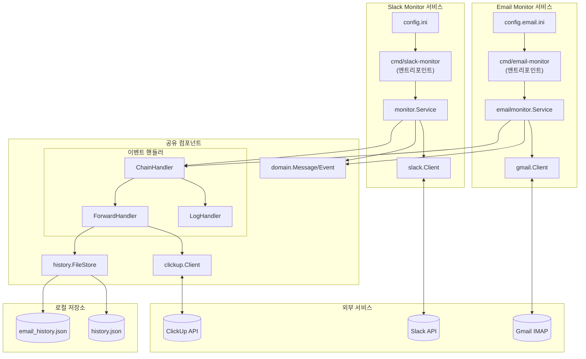
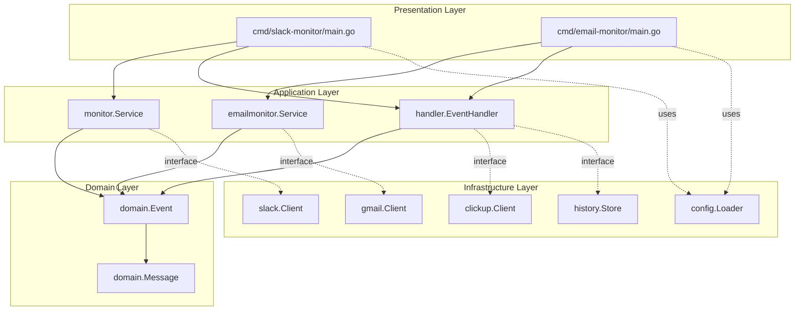
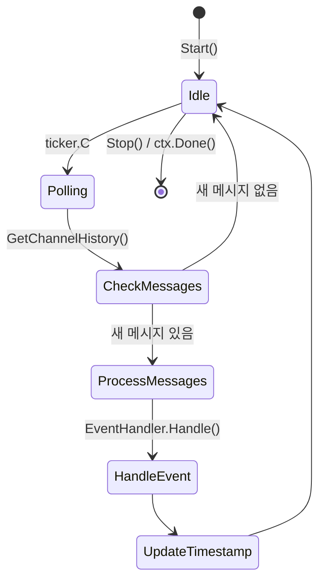
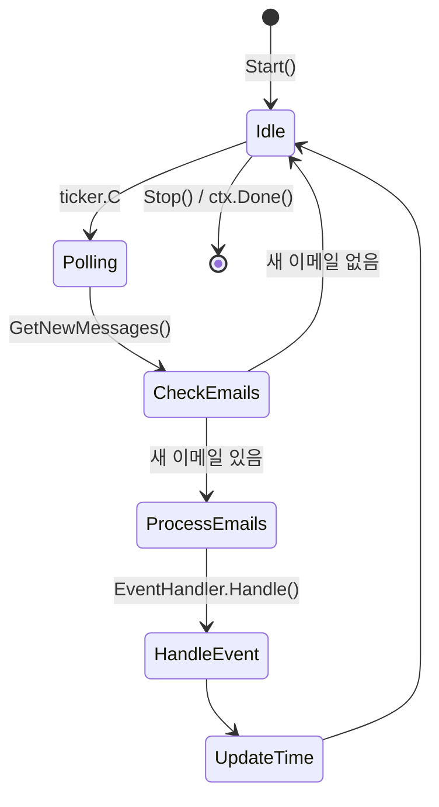
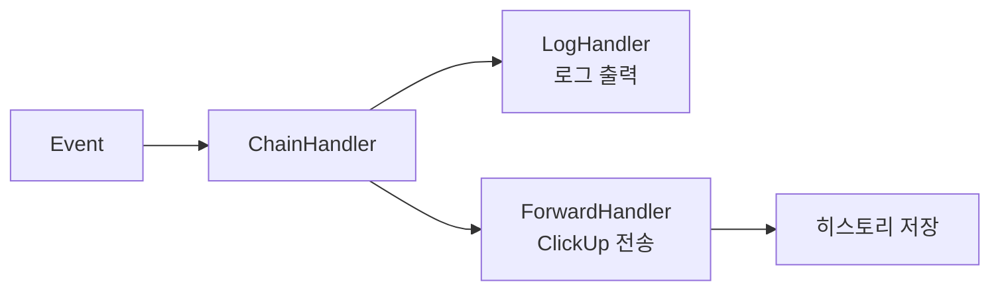
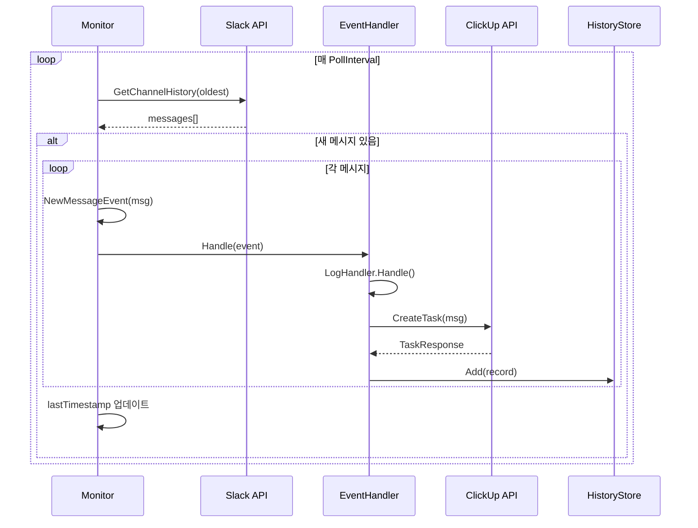
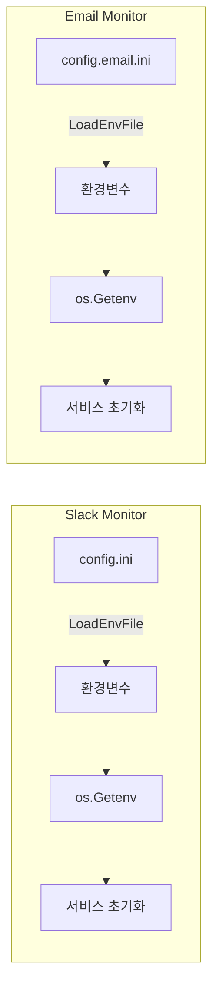
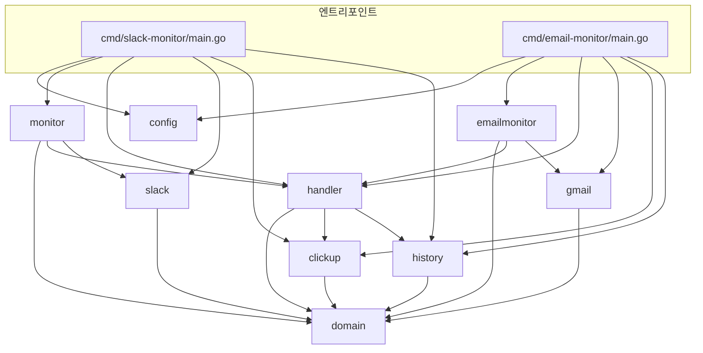

# SlickWebhook 아키텍처 문서

## 개요

SlickWebhook은 **멀티 소스 모니터링 서비스**로, Slack 채널과 Gmail을 실시간으로 모니터링하여 새 메시지/이메일 감지 시 ClickUp 태스크를 자동 생성하는 Go 기반 서비스입니다.

### 지원 소스

| 소스 | 설명 | 엔트리포인트 |
|------|------|--------------|
| Slack | 채널 메시지 모니터링 (봇 필터링 지원) | `cmd/slack-monitor/` |
| Gmail | IMAP 기반 이메일 모니터링 (발신자/라벨 필터링) | `cmd/email-monitor/` |

## 시스템 아키텍처

### 전체 구조



### 레이어 구조 (Clean Architecture)



## 컴포넌트 상세

### 1. 도메인 모델 (`internal/domain/`)

핵심 비즈니스 엔티티를 정의합니다. **멀티 소스 지원**을 위해 `Source` 필드와 Email 전용 필드가 추가되었습니다.

| 타입 | 설명 |
|------|------|
| `Message` | 통합 메시지 모델 (Slack/Email 공용) |
| `Event` | 이벤트 래퍼 (Type, Message, Error, OccurredAt) |
| `EventType` | 이벤트 종류 (`new_message`, `error`) |

**Message 필드 구조:**

| 필드 | 타입 | 용도 | Slack | Email |
|------|------|------|-------|-------|
| `Source` | string | 메시지 출처 | `"slack"` | `"email"` |
| `Timestamp` | string | 고유 식별자 | Slack ts | IMAP UID |
| `UserID` | string | 사용자 ID | O | - |
| `BotID` | string | 봇 ID | O | - |
| `Text` | string | 본문 | O | O |
| `ChannelID` | string | 채널 ID | O | - |
| `CreatedAt` | time.Time | 생성 시간 | O | O |
| `Subject` | string | 이메일 제목 | - | O |
| `From` | string | 발신자 | - | O |
| `MessageID` | string | 이메일 ID | - | O |

### 2. Slack 모니터 서비스 (`internal/monitor/`)



**주요 책임:**

- 폴링 기반 Slack 채널 모니터링
- 마지막 타임스탬프 관리 (중복 방지)
- 이벤트 생성 및 핸들러 위임
- 봇 메시지 필터링 지원

### 3. Email 모니터 서비스 (`internal/emailmonitor/`)



**주요 책임:**

- 폴링 기반 Gmail 모니터링 (IMAP)
- 마지막 시간 관리 (중복 방지)
- 이벤트 생성 및 핸들러 위임
- 발신자/라벨 필터링 지원

### 4. 이벤트 핸들러 (`internal/handler/`)

**Chain of Responsibility 패턴** 적용:



| 핸들러 | 역할 |
|--------|------|
| `LogHandler` | 이벤트 로그 출력 |
| `ForwardHandler` | ClickUp 태스크 생성 + 히스토리 관리 |
| `ChainHandler` | 핸들러 체이닝 (순차 실행) |

### 5. 외부 클라이언트

#### Slack Client (`internal/slack/`)

```go
type Client interface {
    GetChannelHistory(ctx context.Context, channelID, oldest string) ([]*domain.Message, error)
}
```

#### Gmail Client (`internal/gmail/`)

```go
type Client interface {
    GetNewMessages(ctx context.Context, since time.Time) ([]*domain.Message, error)
    Close() error
}
```

**특징:**

- OAuth2 인증 (XOAUTH2)
- IMAP 기반 이메일 조회
- 발신자 필터링 (`FilterFrom`)
- 라벨 필터링 (`FilterLabel`, 기본: INBOX)

#### ClickUp Client (`internal/clickup/`)

```go
type Client interface {
    CreateTask(ctx context.Context, msg *domain.Message) (*TaskResponse, error)
}
```

### 6. 히스토리 저장소 (`internal/history/`)

```go
type Store interface {
    Add(record *Record)
    Count() int
}
```

- **구현체**: `FileStore` (JSON 파일 기반)
- **제한**: `HISTORY_MAX_SIZE` (기본 100개, FIFO)

## 데이터 흐름

### 메시지 처리 시퀀스



## 설정 흐름



**설정 우선순위**: 설정 파일 → 환경변수

| 서비스 | 설정 파일 | 히스토리 파일 |
|--------|-----------|---------------|
| Slack Monitor | `config.ini` | `history.json` |
| Email Monitor | `config.email.ini` | `email_history.json` |

## 의존성 그래프



## 확장 포인트

### 새 이벤트 핸들러 추가

```go
// 1. EventHandler 인터페이스 구현
type MyHandler struct{}

func (h *MyHandler) Handle(event *domain.Event) {
    // 처리 로직
}

// 2. ChainHandler에 추가
eventHandler = handler.NewChainHandler(
    logHandler,
    forwardHandler,
    myHandler,  // 새 핸들러
)
```

### 새 저장소 백엔드 추가

```go
// 1. Store 인터페이스 구현
type RedisStore struct{}

func (s *RedisStore) Add(record *Record) { ... }
func (s *RedisStore) Count() int { ... }

// 2. ForwardHandler에 주입
forwardHandler := handler.NewForwardHandler(handler.ForwardHandlerConfig{
    HistoryStore: redisStore,
    ...
})
```

### 새 모니터 소스 추가

새로운 메시지 소스(예: Discord, Teams)를 추가하려면:

```go
// 1. Client 인터페이스 정의 (internal/discord/)
type Client interface {
    GetNewMessages(ctx context.Context, since time.Time) ([]*domain.Message, error)
}

// 2. Service 구현 (internal/discordmonitor/)
type Service struct {
    client  discord.Client
    handler handler.EventHandler
    // ...
}

// 3. domain.Message 생성 시 Source 필드 설정
msg := &domain.Message{
    Source:    "discord",
    Text:      content,
    CreatedAt: time.Now(),
}

// 4. 엔트리포인트 생성 (cmd/discord-monitor/)
```

## 기술 스택

| 영역 | 기술 |
|------|------|
| 언어 | Go 1.23+ |
| Slack SDK | [slack-go/slack](https://github.com/slack-go/slack) |
| IMAP | [emersion/go-imap](https://github.com/emersion/go-imap) |
| OAuth2 | [golang.org/x/oauth2](https://pkg.go.dev/golang.org/x/oauth2) |
| HTTP | 표준 라이브러리 `net/http` |
| 저장소 | 로컬 JSON 파일 |
| 배포 | 바이너리 / macOS launchd |

## 비기능 요구사항

| 항목 | Slack Monitor | Email Monitor |
|------|---------------|---------------|
| 메모리 | ~15-30 MB | ~20-40 MB |
| 폴링 간격 | 기본 10초 | 기본 30초 |
| 히스토리 크기 | 기본 100개 | 기본 100개 |
| 타임아웃 | ClickUp API 30초 | ClickUp API 30초 |
| 재시작 | launchd 지원 | launchd 지원 |
