# SlickWebhook 아키텍처 문서

## 개요

SlickWebhook은 **멀티 소스 모니터링 서비스**로, Slack 채널과 Gmail을 실시간으로 모니터링하여 새 메시지/이메일 감지 시 ClickUp 태스크를 자동 생성하고, **AI 에이전트로 자동 처리**하는 Go 기반 서비스입니다.

### 지원 소스/서비스

| 서비스 | 설명 | 엔트리포인트 |
|--------|------|--------------|
| Slack Monitor | 채널 메시지 모니터링 (봇 필터링 지원) | `cmd/slack-monitor/` |
| Email Monitor | IMAP 기반 이메일 모니터링 (발신자/라벨 필터링) | `cmd/email-monitor/` |
| AI Worker | ClickUp 태스크 → AI 에이전트 자동 실행 | `cmd/ai-worker/` |

## 시스템 아키텍처

### 전체 구조

#### Email/Slack Monitor


#### AI Worker


### 레이어 구조 (Clean Architecture)


## 컴포넌트 상세

### 1. 도메인 모델 (`internal/domain/`)

핵심 비즈니스 엔티티를 정의합니다. **멀티 소스 지원**을 위해 `Source` 필드와 Email 전용 필드가 추가되었습니다.

| 타입 | 설명 |
|------|------|
| `Message` | 통합 메시지 모델 (Slack/Email 공용) |
| `Event` | 이벤트 래퍼 (Type, Message, Error, OccurredAt) |
| `EventType` | 이벤트 종류 (`new_message`, `error`) |

**Message 필드 구조:**

| 필드 | 타입 | 용도 | Slack | Email |
|------|------|------|-------|-------|
| `Source` | string | 메시지 출처 | `"slack"` | `"email"` |
| `Timestamp` | string | 고유 식별자 | Slack ts | IMAP UID |
| `UserID` | string | 사용자 ID | O | - |
| `BotID` | string | 봇 ID | O | - |
| `Text` | string | 본문 | O | O |
| `ChannelID` | string | 채널 ID | O | - |
| `CreatedAt` | time.Time | 생성 시간 | O | O |
| `Subject` | string | 이메일 제목 | - | O |
| `From` | string | 발신자 | - | O |
| `MessageID` | string | 이메일 ID | - | O |

### 2. Slack 모니터 서비스 (`internal/monitor/`)

```mermaid
stateDiagram-v2
    [*] --> Idle: Start()
    Idle --> Polling: ticker.C
    Polling --> CheckMessages: GetChannelHistory()
    CheckMessages --> ProcessMessages: 새 메시지 있음
    CheckMessages --> Idle: 새 메시지 없음
    ProcessMessages --> HandleEvent: EventHandler.Handle()
    HandleEvent --> UpdateTimestamp
    UpdateTimestamp --> Idle
    Idle --> [*]: Stop() / ctx.Done()
```



**주요 책임:**

- 폴링 기반 Slack 채널 모니터링
- 마지막 타임스탬프 관리 (중복 방지)
- 이벤트 생성 및 핸들러 위임
- 봇 메시지 필터링 지원

### 3. Email 모니터 서비스 (`internal/emailmonitor/`)

```mermaid
stateDiagram-v2
    [*] --> Idle: Start()
    Idle --> Polling: ticker.C
    Polling --> CheckEmails: GetNewMessages()
    CheckEmails --> ProcessEmails: 새 이메일 있음
    CheckEmails --> Idle: 새 이메일 없음
    ProcessEmails --> HandleEvent: EventHandler.Handle()
    HandleEvent --> UpdateTime
    UpdateTime --> Idle
    Idle --> [*]: Stop() / ctx.Done()
```



**주요 책임:**

- 폴링 기반 Gmail 모니터링 (IMAP)
- ProcessedStore 기반 중복 방지 (SQLite DB)
- 이벤트 생성 및 핸들러 위임
- 발신자/라벨/제목 필터링 지원

**설정 옵션:**

| 환경변수 | 설명 | 기본값 |
|----------|------|--------|
| `POLL_INTERVAL` | 폴링 간격 | 30초 |
| `LOOKBACK_DURATION` | 시작 시 과거 이메일 조회 기간 | 0 (현재 시점부터) |
| `RETENTION_DAYS` | 처리된 이메일 DB 보관 기간 | 90일 |
| `FILTER_FROM` | 포함할 발신자 (콤마 구분) | - |
| `FILTER_EXCLUDE` | 제외할 발신자 (콤마 구분) | - |
| `FILTER_EXCLUDE_SUBJECT` | 제외할 제목 키워드 (콤마 구분) | - |
| `FILTER_LABEL` | 모니터링할 라벨 | INBOX |
| `SLACK_NOTIFY_ENABLED` | Slack 알림 활성화 | false |
| `SLACK_BOT_TOKEN` | Slack Bot OAuth 토큰 | - |
| `SLACK_NOTIFY_CHANNEL` | 알림 전송 채널 ID | - |

### 4. 이벤트 핸들러 (`internal/handler/`)

**Chain of Responsibility 패턴** 적용:

```mermaid
flowchart LR
    EVENT[Event] --> CHAIN[ChainHandler]
    CHAIN --> LOG[LogHandler<br/>로그 출력]
    CHAIN --> FWD[ForwardHandler<br/>ClickUp 전송]
    CHAIN --> SLACK[SlackNotifyHandler<br/>Slack 알림]
    FWD --> HISTORY[히스토리 저장]
    SLACK --> SLACK_API[Slack API]
```



| 핸들러 | 역할 |
|--------|------|
| `LogHandler` | 이벤트 로그 출력 |
| `ForwardHandler` | ClickUp 태스크 생성 + 히스토리 관리 |
| `SlackNotifyHandler` | Slack 채널 알림 전송 (Email 소스 전용) |
| `ChainHandler` | 핸들러 체이닝 (순차 실행) |

#### SlackNotifyHandler

이메일 수신 시 Slack 채널로 알림을 전송합니다.

**Slack Block Kit 메시지 형식:**

```text
┌─────────────────────────────────────────┐
│  📧 새 이메일 알림                        │  Header
├─────────────────────────────────────────┤
│  *발신자:* sender@example.com            │
│  *제목:* [JIRA-123] 이슈 업데이트          │  Section
│  *시간:* 2025-01-07 14:30:25             │
├─────────────────────────────────────────┤
│  > 본문 미리보기 (최대 300자)...           │  Section
├─────────────────────────────────────────┤
│  Email Monitor 자동 알림                  │  Context
└─────────────────────────────────────────┘
```

**필요 Slack Bot 권한:** `chat:write`, `chat:write.public`

### 5. 외부 클라이언트

#### Slack Client (`internal/slack/`)

```go
type Client interface {
    GetChannelHistory(ctx context.Context, channelID, oldest string) ([]*domain.Message, error)
    PostMessage(ctx context.Context, channelID string, blocks []slack.Block, text string) error
}
```

**주요 기능:**

| 메서드 | 용도 |
|--------|------|
| `GetChannelHistory` | 채널 메시지 히스토리 조회 (Slack Monitor용) |
| `PostMessage` | Block Kit 형식 메시지 전송 (Email→Slack 알림용) |

#### Gmail Client (`internal/gmail/`)

```go
type Client interface {
    GetNewMessages(ctx context.Context, since time.Time) ([]*domain.Message, error)
    Close() error
}
```

**특징:**

- OAuth2 인증 (XOAUTH2)
- IMAP 기반 이메일 조회
- 발신자 필터링 (`FilterFrom`) - 포함 필터
- 발신자 제외 필터링 (`FilterExclude`) - 특정 발신자 제외
- 제목 제외 필터링 (`FilterExcludeSubject`) - 특정 제목 키워드 제외
- 라벨 필터링 (`FilterLabel`, 기본: INBOX)

#### ClickUp Client (`internal/clickup/`)

```go
type Client interface {
    CreateTask(ctx context.Context, msg *domain.Message) (*TaskResponse, error)
}
```

### 6. 히스토리 저장소 (`internal/history/`)

```go
type Store interface {
    Add(record *Record)
    Count() int
}
```

- **구현체**: `FileStore` (JSON 파일 기반)
- **제한**: `HISTORY_MAX_SIZE` (기본 100개, FIFO)

### 7. 처리된 메시지 저장소 (`internal/store/`)

Email Monitor 전용 SQLite 기반 중복 방지 저장소입니다.

```go
type ProcessedStore interface {
    IsProcessed(messageID string) (bool, error)
    MarkProcessed(messageID string, subject string) error
    GetCount() (int, error)
    Cleanup(retentionDays int) (int, error)
    Close() error
}
```

**특징:**

- SQLite 기반 영구 저장소 (`processed_emails.db`)
- Message-ID 기반 중복 체크
- 자동 레코드 정리 (`RETENTION_DAYS`, 기본 90일)
- 스레드 세이프 (sync.RWMutex)

**Email Monitor 중복 방지 흐름:**

```mermaid
flowchart LR
    A[새 이메일] --> B{IsProcessed?}
    B -->|Yes| C[스킵]
    B -->|No| D[이벤트 처리]
    D --> E[MarkProcessed]
    E --> F[DB 저장]
```



## 데이터 흐름

### 메시지 처리 시퀀스

```mermaid
sequenceDiagram
    participant M as Monitor
    participant S as Slack API
    participant H as EventHandler
    participant C as ClickUp API
    participant HS as HistoryStore

    loop 매 PollInterval
        M->>S: GetChannelHistory(oldest)
        S-->>M: messages[]

        alt 새 메시지 있음
            loop 각 메시지
                M->>M: NewMessageEvent(msg)
                M->>H: Handle(event)
                H->>H: LogHandler.Handle()
                H->>C: CreateTask(msg)
                C-->>H: TaskResponse
                H->>HS: Add(record)
            end
            M->>M: lastTimestamp 업데이트
        end
    end
```



## 설정 흐름

```mermaid
flowchart LR
    subgraph SlackMonitor["Slack Monitor"]
        A1[config.ini] -->|LoadEnvFile| B1[환경변수]
        B1 --> C1[os.Getenv]
        C1 --> D1[서비스 초기화]
    end

    subgraph EmailMonitor["Email Monitor"]
        A2[config.email.ini] -->|LoadEnvFile| B2[환경변수]
        B2 --> C2[os.Getenv]
        C2 --> D2[서비스 초기화]
    end
```



**설정 우선순위**: 설정 파일 → 환경변수

| 서비스 | 설정 파일 | 저장소 파일 |
|--------|-----------|-------------|
| Slack Monitor | `config.ini` | `history.json` |
| Email Monitor | `config.email.ini` | `email_history.json`, `processed_emails.db` |

## 의존성 그래프

```mermaid
flowchart TD
    subgraph Entrypoints["엔트리포인트"]
        SLACK_MAIN["cmd/slack-monitor/main.go"]
        EMAIL_MAIN["cmd/email-monitor/main.go"]
    end

    SLACK_MAIN --> CONFIG["config"]
    EMAIL_MAIN --> CONFIG

    SLACK_MAIN --> MONITOR["monitor"]
    SLACK_MAIN --> HANDLER["handler"]
    SLACK_MAIN --> SLACK["slack"]
    SLACK_MAIN --> CLICKUP["clickup"]
    SLACK_MAIN --> HISTORY["history"]

    EMAIL_MAIN --> EMAIL_MONITOR["emailmonitor"]
    EMAIL_MAIN --> HANDLER
    EMAIL_MAIN --> GMAIL["gmail"]
    EMAIL_MAIN --> CLICKUP
    EMAIL_MAIN --> HISTORY
    EMAIL_MAIN --> STORE
    EMAIL_MAIN --> SLACK_NOTIFY["slack (알림)"]

    MONITOR --> DOMAIN["domain"]
    MONITOR --> HANDLER
    MONITOR --> SLACK

    EMAIL_MONITOR --> DOMAIN
    EMAIL_MONITOR --> HANDLER
    EMAIL_MONITOR --> GMAIL
    EMAIL_MONITOR --> STORE

    HANDLER --> DOMAIN
    HANDLER --> CLICKUP
    HANDLER --> HISTORY
    HANDLER --> SLACK_NOTIFY

    SLACK --> DOMAIN
    SLACK_NOTIFY --> DOMAIN
    GMAIL --> DOMAIN
    CLICKUP --> DOMAIN
    HISTORY --> DOMAIN
```



## 확장 포인트

### 새 이벤트 핸들러 추가

```go
// 1. EventHandler 인터페이스 구현
type MyHandler struct{}

func (h *MyHandler) Handle(event *domain.Event) {
    // 처리 로직
}

// 2. ChainHandler에 추가
eventHandler = handler.NewChainHandler(
    logHandler,
    forwardHandler,
    slackNotifyHandler,  // Slack 알림
    myHandler,           // 새 핸들러
)
```

### 새 저장소 백엔드 추가

```go
// 1. Store 인터페이스 구현
type RedisStore struct{}

func (s *RedisStore) Add(record *Record) { ... }
func (s *RedisStore) Count() int { ... }

// 2. ForwardHandler에 주입
forwardHandler := handler.NewForwardHandler(handler.ForwardHandlerConfig{
    HistoryStore: redisStore,
    ...
})
```

### 새 모니터 소스 추가

새로운 메시지 소스(예: Discord, Teams)를 추가하려면:

```go
// 1. Client 인터페이스 정의 (internal/discord/)
type Client interface {
    GetNewMessages(ctx context.Context, since time.Time) ([]*domain.Message, error)
}

// 2. Service 구현 (internal/discordmonitor/)
type Service struct {
    client  discord.Client
    handler handler.EventHandler
    // ...
}

// 3. domain.Message 생성 시 Source 필드 설정
msg := &domain.Message{
    Source:    "discord",
    Text:      content,
    CreatedAt: time.Now(),
}

// 4. 엔트리포인트 생성 (cmd/discord-monitor/)
```

## 기술 스택

| 영역 | 기술 |
|------|------|
| 언어 | Go 1.23+ |
| Slack SDK | [slack-go/slack](https://github.com/slack-go/slack) |
| IMAP | [emersion/go-imap](https://github.com/emersion/go-imap) |
| OAuth2 | [golang.org/x/oauth2](https://pkg.go.dev/golang.org/x/oauth2) |
| SQLite | [mattn/go-sqlite3](https://github.com/mattn/go-sqlite3) |
| HTTP | 표준 라이브러리 `net/http` |
| 저장소 | 로컬 JSON 파일, SQLite DB |
| 배포 | 바이너리 / macOS launchd |

## 비기능 요구사항

| 항목 | Slack Monitor | Email Monitor |
|------|---------------|---------------|
| 메모리 | ~15-30 MB | ~20-40 MB |
| 폴링 간격 | 기본 10초 | 기본 30초 |
| 히스토리 크기 | 기본 100개 | 기본 100개 |
| 타임아웃 | ClickUp API 30초 | ClickUp API 30초 |
| 재시작 | launchd 지원 | launchd 지원 |
